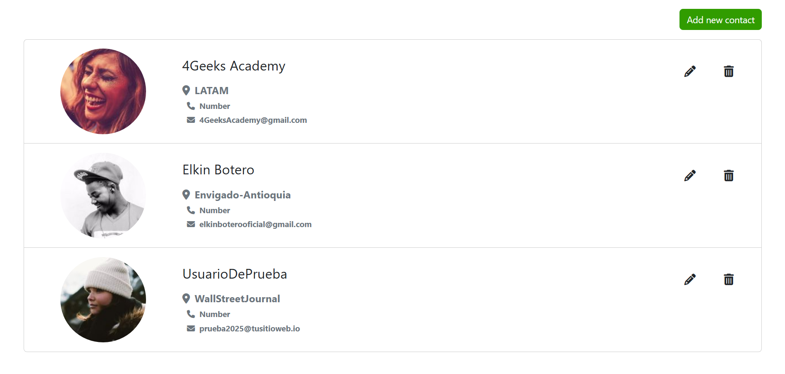
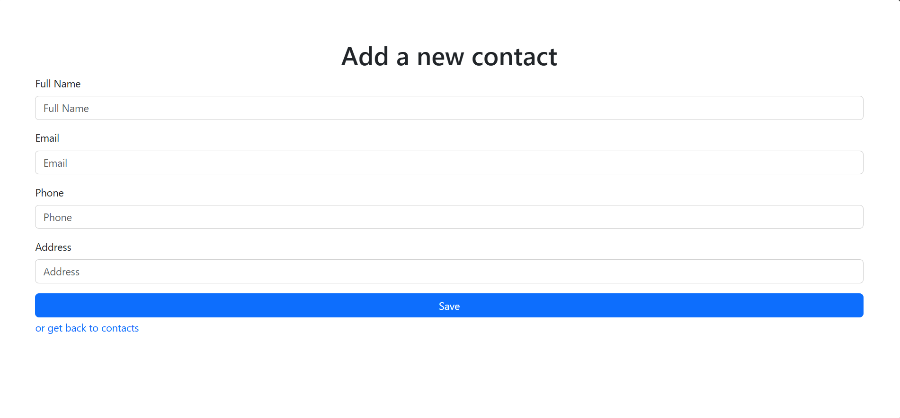
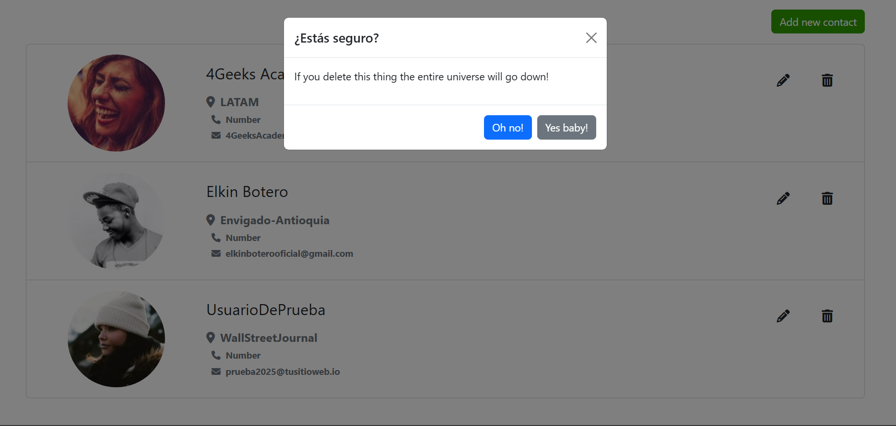

# 📒 Lista de Contactos con React + Context

## Índice

- [Descripción](#descripción)
- [Capturas de pantalla](#capturas-de-pantalla)
- [Instalación](#instalación)
- [Uso rápido](#uso-rápido)
- [Configuración](#configuración)
- [Scripts disponibles](#scripts-disponibles)
- [Estructura del proyecto](#estructura-del-proyecto)
- [Contribución](#contribución)
- [Licencia y autores](#licencia-y-autores)
- [Contacto y soporte](#contacto-y-soporte)

---

## Descripción

Aplicación web para gestionar una lista de contactos, desarrollada con React, Context API y useReducer. Permite agregar, editar y eliminar contactos, integrando persistencia con una API externa. Ideal como base para proyectos CRUD modernos.

---

## Tecnologías utilizadas

| Tecnología   | Versión | Descripción                            |
| ------------ | ------- | -------------------------------------- |
| React        | 18.x    | Librería principal para la UI          |
| React Router | 6.x     | Ruteo SPA                              |
| Context API  | nativo  | Estado global                          |
| useReducer   | nativo  | Manejo de estado complejo              |
| Vite         | 4.x     | Bundler y servidor de desarrollo       |
| ESLint       | 8.x     | Linter para mantener calidad de código |
| PropTypes    | 15.x    | Validación de props (opcional)         |
| Fetch API    | nativo  | Llamadas HTTP a la API                 |
| Bootstrap    | 5.x     | Estilos y componentes responsivos      |

---

## Capturas de pantalla

Las capturas deben guardarse en la carpeta `screenshots` en la raíz del proyecto. Ejemplo de rutas:





---

## Instalación

### Prerrequisitos

- Node.js >= 20
- npm

### Pasos

```bash
git clone https://github.com/4GeeksAcademy/lista-de-contactos-react-y-context
cd lista-de-contactos-react-y-context
npm install
cp .env.example .env
```

> **Nota:**
>
> - El comando `cd` cambia de carpeta en la terminal.
> - El comando `cp .env.example .env` crea tu archivo de variables de entorno a partir del ejemplo.

---

## Uso rápido

```bash
npm run start
```
Abre tu navegador y accede a la URL que te indique la terminal tras ejecutar `npm run start`.

---

## Configuración

- El archivo `.env` permite definir variables de entorno (por ejemplo, URLs de APIs, claves, puertos, etc.) sin exponerlas en el código fuente. Puedes personalizarlo según tus necesidades.
- Puedes modificar la URL de la API en `src/actions.js` (`URL_BASE`).

---

## Scripts disponibles

- `npm run start` — Inicia el servidor de desarrollo con recarga en vivo.
- `npm run build` — Genera la versión de producción.
- `npm run preview` — Previsualiza la build de producción.
- `npm run lint` — Ejecuta ESLint para mantener el código limpio y consistente (lint es una herramienta que detecta errores y problemas de estilo en tu código).

---

## Estructura del proyecto

```
src/
  components/
    ContactoCard.jsx
    ModalConfirmacion.jsx
    Navbar.jsx
  pages/
    Home.jsx
    FormularioContacto.jsx
    Layout.jsx
  hooks/
    useGlobalReducer.jsx
  store.js
  actions.js
  routes.jsx
  main.jsx
  index.css
```

- **Componentes**: UI reutilizable.
- **Pages**: Vistas principales y rutas.
- **Store/Actions**: Estado global y lógica de negocio.
- **Hooks**: Acceso al store y dispatch.

---

## Contribución

1. Haz un fork del repositorio.
2. Crea una rama: `git checkout -b feature/nueva-funcionalidad`
3. Realiza tus cambios y haz commit: `git commit -m 'Agrega nueva funcionalidad'`
4. Haz push a tu fork: `git push origin feature/nueva-funcionalidad`
5. Abre un Pull Request.

**Guías:**

- Sigue el estilo de código existente (lint y formateo).
- Añade comentarios y documentación si es necesario.
- Incluye capturas si tu cambio afecta la UI.

---

## Licencia y autores

MIT © [Elkin Botero](https://github.com/eybagit)

Desarrollado por [4Geeks Academy](https://4geeksacademy.com/) y la comunidad.

---

## Contacto y soporte

¿Dudas, sugerencias o problemas?

- Abre un issue en [GitHub](https://github.com/4GeeksAcademy/lista-de-contactos-react-y-context/issues).
- [Email de contacto](mailto:elkinboterooficial@gmail.com)
- [Slack de 4Geeks Academy](https://4geeksacademy.slack.com/team/U08QM413VMH)

---

---

## Glosario y preguntas frecuentes

- **¿Qué es un badge?** Son insignias visuales que muestran el estado del proyecto (build, dependencias, etc.).
- **¿Para qué sirve el archivo `.env`?** Permite definir variables de entorno sensibles o configurables sin exponerlas en el código fuente.
- **¿Qué es lint?** Es una herramienta que revisa tu código y te ayuda a mantenerlo limpio y consistente.
- **¿Cómo funcionan los enlaces del índice?** Los enlaces como `[Descripción](#descripción)` te llevan directamente a la sección correspondiente del README.
- **¿Dónde van las capturas de pantalla?** En la carpeta `screenshots` en la raíz del proyecto. Ejemplo: `screenshots/home.png`.
- **¿Qué hace `cd` y `cp`?** `cd` cambia de carpeta en la terminal, `cp` copia archivos.
- **¿Cómo puedo contribuir?** Haz un fork del repositorio, crea una rama, realiza tus cambios y abre un Pull Request siguiendo las guías de contribución.

---

> ¡Gracias por contribuir y usar este proyecto!  
> _Recuerda mantener este README actualizado con cada cambio relevante._
